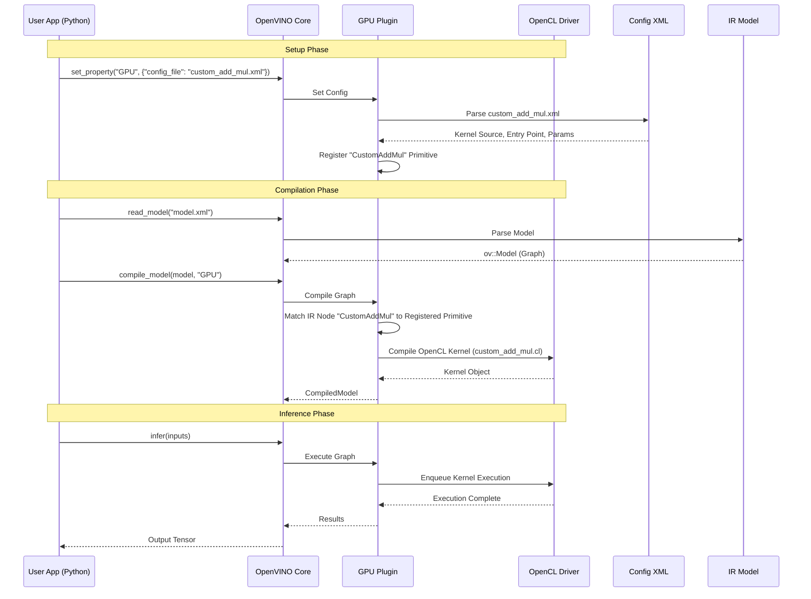
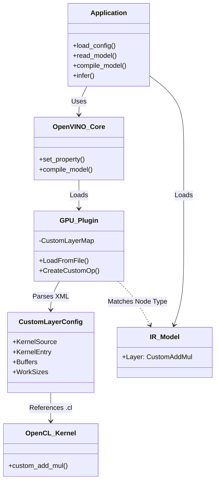

# OpenVINO Custom GPU Operator Tutorial

This tutorial demonstrates how to add a custom OpenCL operator to the OpenVINO GPU plugin without recompiling OpenVINO.

## Overview

The process involves:
1.  **Kernel Implementation**: Writing the OpenCL C kernel code (`.cl`).
2.  **Configuration**: Creating an XML file (`.xml`) that describes the custom layer and maps it to the kernel.
3.  **Model Creation**: Creating an OpenVINO IR model (`.xml` + `.bin`) that uses the custom layer type.
4.  **Execution**: Loading the configuration and model in an OpenVINO application.

## Files

*   `custom_add_mul.cl`: The OpenCL kernel implementation.
*   `custom_add_mul.xml`: The configuration file for the custom layer.
*   `model.xml`: A manually created OpenVINO IR model using the `CustomAddMul` layer.
*   `test_custom_op.py`: A Python script to run the inference.

## Interaction Flow

The following sequence diagram illustrates how the components interact when adding and using a custom GPU operator.



## Component Relationship



## Steps to Run

1.  Ensure you have OpenVINO installed (tested with 2025.3.0) and an Intel GPU available with OpenCL drivers.
2.  Generate the IR model:
    ```bash
    python create_model.py
    ```
    *This generates `model.xml` and `model.bin` with the correct topology (CustomAddMul node).*
3.  Run the test script:
    ```bash
    python test_custom_op.py
    ```

## Implementation Details

### 1. OpenCL Kernel (`custom_add_mul.cl`)

The kernel performs `(A + B) * C` on float32 data.

```c
__kernel void custom_add_mul(
    const __global float* in0,
    const __global float* in1,
    const __global float* in2,
    __global float* out)
{
    const uint idx = get_global_id(0);
    out[idx] = (in0[idx] + in1[idx]) * in2[idx];
}
```

### 2. Configuration (`custom_add_mul.xml`)

Defines the mapping between the IR layer and the kernel. Note that `WorkSizes` calculates the global work size dynamically based on input dimensions.

```xml
<CustomLayer name="CustomAddMul" type="SimpleGPU" version="1">
    <Kernel entry="custom_add_mul">
        <Source filename="custom_add_mul.cl"/>
    </Kernel>
    <Buffers>
        <Tensor arg-index="0" port-index="0" type="input" format="BFYX"/>
        <Tensor arg-index="1" port-index="1" type="input" format="BFYX"/>
        <Tensor arg-index="2" port-index="2" type="input" format="BFYX"/>
        <Tensor arg-index="3" port-index="0" type="output" format="BFYX"/>
    </Buffers>
    <CompilerOptions options="-cl-mad-enable"/>
    <WorkSizes global="B*F*Y*X"/>
</CustomLayer>
```

### 3. IR Model (`model.xml`)

A standard OpenVINO XML where a layer has `type="CustomAddMul"`.

```xml
<layer id="3" name="custom_op" type="CustomAddMul" version="extension">
    ...
</layer>
```

## Important Notes

### Precision Mismatch
The OpenVINO GPU plugin defaults to **FP16** (half-precision) for performance. However, the custom OpenCL kernel is written for **FP32** (`float`).
If run without configuration, the GPU plugin allocates FP16 buffers while the kernel writes FP32 data, causing memory corruption (garbage output).

To fix this, we force the inference precision to FP32 in `test_custom_op.py`:
```python
config["INFERENCE_PRECISION_HINT"] = "f32"
```

### Configuration Property
The custom layer configuration file is loaded using the internal property key `CONFIG_FILE` (or `cldnn_config_file` in some contexts).
```python
config["CONFIG_FILE"] = "custom_add_mul.xml"
```
